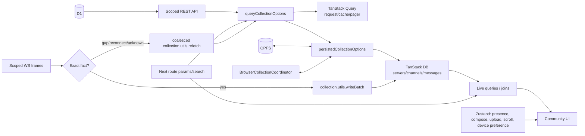

# TanStack official-composition architecture audit

Status: pre-spike audit only. This document does not authorize a production migration.

## Decision

The target client data skeleton is one directional graph:

```text
server -> channel -> message
```

D1 plus the scoped REST API remains the only durable server truth. TanStack Query owns transport, request identity, freshness, and cursor metadata. TanStack DB owns the browser's normalized materialization and reactive projections. OPFS is only a restorable cache around those collections. WebSocket frames are either exact facts applied through the collection's official direct-write API, or freshness signals reconciled through one coalesced `collection.utils.refetch()` call.

The present implementation does not have that ownership split. It uses Query as the REST transport, then a custom publication protocol to copy successful responses into local/persisted collections. Query cache, collection rows, Zustand, and route state can all participate in deciding what is renderable. The spike must first prove that the official Query Collection + persistence composition can replace that protocol before production code changes.

TanStack Router is not installed. `/c` is a Next 16 App Router application and imports `next/navigation`. Therefore the production target below assigns *route-layer* responsibilities to the existing Next router. Adding TanStack Router would be a separate framework migration, not part of this data migration. TanStack Router's own documentation describes it as an alternative router with route matching, loaders, prefetch, params, and search state; those responsibilities must not be duplicated inside DB or Query ([Router overview](https://tanstack.com/router/latest/docs/framework/react/overview), [data loading](https://tanstack.com/router/latest/docs/guide/data-loading)).

## Evidence base

Official contracts used for this audit:

- TanStack DB is a reactive client store for API data: collections normalize rows; live queries filter, join, project, and incrementally update UI ([DB overview](https://tanstack.com/db/latest/docs/overview), [live queries](https://tanstack.com/db/latest/docs/guides/live-queries)).
- `queryCollectionOptions` is the official Query-to-DB bridge. Query keys remain transport cache identity; eager direct writes patch compatible full-result Query data; on-demand direct writes revalidate active subsets and discard inactive subsets. `utils.refetch()` is an application barrier outside an active mutation, including no-diff results ([Query Collection](https://tanstack.com/db/latest/docs/collections/query-collection)).
- On-demand collections receive predicate/order/limit/offset demand through `ctx.meta.loadSubsetOptions`; the query function must translate the complete demand before pagination. One business-scoped collection should serve its subsets; separate collections represent distinct server resources ([Query Collection](https://tanstack.com/db/latest/docs/collections/query-collection)).
- TanStack Query's cache is keyed server-state transport. Stale data can refetch on mount, focus, and reconnect; inactive queries are garbage-collected. It is not a second normalized entity store ([important defaults](https://tanstack.com/query/latest/docs/framework/react/guides/important-defaults), [QueryCache](https://tanstack.com/query/latest/docs/framework/react/reference/classes/QueryCache)).
- `BrowserCollectionCoordinator` uses Web Locks for ownership and BroadcastChannel for committed transactions. A committed transaction remains complete across the coordinator. Indeterminate leader outcomes must be reconciled, not replayed against an unknown leader. OPFS uses a worker; `pagehide` terminates it, and a persisted `pageshow` requires fresh database, persistence, and collection instances ([official persistence README](https://github.com/TanStack/db/blob/main/packages/browser-db-sqlite-persistence/README.md)).
- The compatible missing package is `@tanstack/query-db-collection@1.2.15`; it depends on `@tanstack/db@0.9.2` and accepts Query Core 5 ([official package manifest](https://github.com/TanStack/db/blob/main/packages/query-db-collection/package.json)).

Current-source references below are paths and line ranges in `feat/tanstack-db-persistence` at audit time.

## Current data flow

### Server list and server tree

```text
D1/shared queries
  -> scoped REST routes
  -> useQuery queryFn
  -> capture account/access/custom canonical revision token
  -> custom publication receipt
  -> custom row normalizer + Query shadow key
  -> localOnly/persisted collection
  -> useLiveQuery projection
  -> UI combines Query result + DB result + unread projection
```

Evidence:

- `GET /api/community/servers` reads member-scoped server rows, visible channel ids, unread sources, and mention sources before returning the response: `src/web/src/app/api/community/servers/route.ts:17-64`.
- Server channels authorize membership before `listServerChannelsForViewer`; private visibility is scoped in the query: `src/web/src/app/api/community/servers/[id]/channels/route.ts:23-35`.
- Categories authorize the server member before the server-scoped query: `src/web/src/app/api/community/servers/[id]/categories/route.ts:14-24`.
- `serversQueryFn` fetches the REST document; `serversProjectedQueryFn` begins the custom unread snapshot, captures a structural token, and invokes publication: `src/web/src/hooks/community/use-servers.ts:84-156`.
- `serverQueryFn` fans one logical server tree across server identity, categories, and channels; `serverProjectedQueryFn` then publishes the combined document: `src/web/src/hooks/community/use-servers.ts:351-427`.
- `useServers` and `useServer` read both Query state and DB projections, then compute `isLiveAuthoritative` by comparing both representations: `src/web/src/hooks/community/use-servers.ts:166-283`, `src/web/src/hooks/community/use-servers.ts:434-535`.

### Messages

```text
authorized message REST window
  -> useInfiniteQuery page document
  -> custom token + publication into canonical messages
  -> custom activation/anchor/receipt gates
  -> Query page window joined back to canonical DB by id
  -> custom atomic window
  -> optimistic/outbox overlay
  -> UI
```

Evidence:

- The message route resolves the actor and authorized surface before querying. The human endpoint supports newest, older cursor, newer/since, and anchor windows: `src/web/src/app/api/community/channels/[id]/messages/route.ts:56-173`.
- The client maps its five page modes into REST parameters and publishes every accepted page separately into DB: `src/web/src/hooks/community/use-messages.ts:224-317`.
- `useInfiniteQuery` is surrounded by custom retained-observer activation revalidation, page-param rewriting, anchor repair, retry, page merge, and cursor edge handling: `src/web/src/hooks/community/use-messages.ts:603-807`, `src/web/src/hooks/community/use-messages.ts:850-1020`.
- `useMessages` selects a DB-restored window before transport observation, later joins the Query page back to canonical rows by message id, freezes an atomic canonical window, applies the message-stream overlay, and gates navigation on a separate receipt: `src/web/src/hooks/community/use-messages.ts:1079-1193`.

### WebSocket ingress

```text
WS frame
  -> event-specific handler(s)
  -> Query cache patches / invalidations
  -> custom DB projection with event write context
  -> Zustand access, presence, dedupe, optimistic overlays
  -> UI
```

Evidence:

- The DB projector wraps WS frames in a custom `event` write context, then implements entity-specific upsert/patch/delete logic for messages, reactions, membership, profile, channel, and server events: `src/web/src/lib/community-db/sync.ts:2531-2885`.
- Custom canonical revisions, per-entity revisions, and pending operations protect a late REST publication from overwriting a newer WS write: `src/web/src/lib/community-db/sync.ts:83-235`.
- The WS Zustand store also owns access epochs/revocation, account epochs, message-id dedupe, delivery-operation digest state, presence, connection status, and bot audit rings: `src/web/src/stores/community/ws.ts:55-143`, `src/web/src/stores/community/ws.ts:184-280`.
- `installCommunityDbSync` is now a no-op, but the name/lifecycle remains wired. Fresh query functions publish explicitly instead: `src/web/src/lib/community-db/sync.ts:2887-2895`, `src/web/src/app/c/QueryProvider.tsx:110-139`.

### UI projection and navigation

```text
URL params/search + Next router
  + Query transport documents
  + persisted DB projections
  + Zustand current pointers/access epochs
  + local last-channel preference
  + custom navigation intent/publication receipts
  -> route lifecycle and rendered surface
```

Evidence:

- `projections.ts` reads all collections through `useLiveQuery` and builds the server rail, server tree, DM joins, route channel, read state, and message projections: `src/web/src/lib/community-db/projections.ts:95-173`, `src/web/src/lib/community-db/projections.ts:176-392`.
- The community navigation controller uses Next navigation but adds its own intent gate, published-frame gate, and conversation proof cancellation: `src/web/src/components/community/shell/use-community-navigation-controller.ts:33-154`.
- The server layout derives identity from URL params but chooses a server destination from local last-channel, Query cache, DB channels, and an imperative REST fetch: `src/web/src/app/c/channels/layout.tsx:89-140`, `src/web/src/app/c/channels/layout.tsx:208-235`.
- The channel route model combines server Query/DB state, child metadata Query state, DB channel hints, access epochs, WS subscription, Zustand current ids, and imperative purge/navigation on access failure: `src/web/src/hooks/community/use-channel-route-model.ts:64-215`.
- The main Zustand store explicitly stores `currentServerId`, `currentChannelId`, `currentChannelMeta`, subscriptions, timers, pending reply, and UI handlers: `src/web/src/stores/community/index.ts:8-18`, `src/web/src/stores/community/index.ts:217-280`.

## Package and custom-layer inventory

| Layer | Current package/code | Current responsibility | Target owner | Verdict |
|---|---|---|---|---|
| REST server truth | D1 + `@alook/shared` queries + Next route handlers | authorization, scope, pagination, mutations | API/D1 | Keep. Scope-before-query is already correct. |
| Transport | `@tanstack/react-query@5.103.2` | REST cache, infinite pages, freshness, mutations | TanStack Query under Query Collection | Keep, but Query documents stop being UI canonical truth. |
| Normalized client rows | `@tanstack/react-db@0.4.1` / DB `0.9.2` | collections and live queries | TanStack DB | Keep. Make the official collection the only materialized client row owner. |
| REST-to-DB adapter | absent | implemented by custom queryFn publication | `@tanstack/query-db-collection@1.2.15` | Add only after spike proves composition. |
| Persistence | browser SQLite persistence `0.2.23`, wa-sqlite | OPFS restore and multi-tab coordination | persisted collection wrapper | Keep; fix lifecycle to rebuild after persisted `pageshow`. |
| Routing | Next `16.3.6`; no TanStack Router package | URL params/search, transitions, RSC layout | Next App Router | Keep. A TanStack Router migration is explicitly out of scope. |
| Client-only state | Zustand `4.5.7` | mixed UI, route mirrors, WS guards, presence, overlay | Zustand only for ephemeral UI/device state | Reduce. Remove canonical entity/access/freshness ownership. |
| Collection registry | `community-db/collections.ts` | constructs 14 local/persisted collections plus readiness, retention, globals | account-scoped runtime with official descriptors | Replace registry/binding machinery; keep schemas and bounded cache policy if still needed. |
| Publication protocol | `community-db/sync.ts` | revisions, pending ops, tokens, receipts, normalizers, purge | Query Collection + direct writes/refetch | Delete after resource-by-resource cutover. |
| Query shadow cache | `communityKeys.communityDb*` + `collectionRows/publishRows` | mirrors collection arrays inside Query | none | Delete. It is a third representation of the same rows. |
| Query observer lease | `leaseCommunityTransportQueries` | keeps transient transport queries alive across publication | Query Collection tracked-query lifecycle | Delete after cutover. |
| Message window controller | `useMessagesInner` | infinite-query paging, anchor repair, canonical commit gates | Query Collection on-demand loader + official cursor pager; UI owns scroll | Replace transport/canonical portions. Keep viewport/scroll behavior. |
| Unread engine | account unread projection + attention collections | reconciles several REST/WS shapes into flags | read-state/attention associated collections + live projections | Consolidate. Never write `server.unread` or `channel.unread` as independent truth. |
| Optimistic send overlay | message-stream Zustand/reducer | nonce, pending/failed sends, object URL lifetime | DB optimistic transaction where possible; UI upload state where local | Split. Keep device-only file/upload state; migrate entity optimism to DB. |
| Presence | WS Zustand | online/offline ephemeral overlay | Zustand | Keep; presence is transient, not persisted profile truth. |

Installed dependency evidence: `src/web/package.json:40-75`, `src/web/package.json:110-135`, `src/web/package.json:137-166`. The missing Query Collection adapter exactly matches the installed transitive DB version; no TanStack Router dependency or import exists.

## Ownership contract

| Concern | API/D1 | TanStack Query | TanStack DB | Route layer (Next today) | Zustand/device |
|---|---|---|---|---|---|
| server/channel/message truth | authoritative rows and authorization | fetch/mutation transport only | normalized client materialization | ids in URL only | none |
| freshness/retry/cancellation | response semantics | owns request state | `utils.refetch()` application barrier | may await a critical load, not cache entities | connection indicator only |
| UI reads | no | no direct canonical reads after cutover | live queries and joins | selects route identity | transient interaction state |
| realtime exact event | emits scoped fact | may have compatible cache updated by adapter | one `writeBatch` | none | presence/upload-only overlay |
| reconnect/gap/unknown commit | endpoint remains authority | performs refetch | accepts applied result; promise is barrier | may keep transition pending | connection status only |
| offline restore | no claim of current reachability | transport may be unavailable | persisted rows are cache hints | renders route if permitted by current policy | offline banner |
| navigation | no | prefetch/load transport if requested | answers entity/view queries | URL, params, search, transition, not-found/redirect | last-channel preference only |

This split follows the official DB model: Query loads API documents into collections, DB live queries derive views, and optimistic state is overlaid until server state returns. It also prevents the current route from deciding truth by comparing two caches.

## Target dependency graph



The hierarchy is encoded by foreign keys and queries, not nested caches:

```text
servers(id)
└─ channels(id, serverId, parentChannelId?)
   └─ messages(id, channelId, replyToId?)

associated collections
├─ serverMemberships(serverId, userId)
├─ channelMemberships(channelId, userId)
├─ profiles(userId) joined through author/member ids
├─ readStates(channelId, userId) projected with channel/message seq
├─ attentionItems(scopeId/messageId) projected into inbox/unread views
└─ notificationSettings(serverId?/channelId?)
```

Categories, folders, and notification settings are organization/preferences around the skeleton. Profiles and memberships describe actors/relations. Reactions are message-associated state. Unread is a projection of viewer read state, attention, and message/channel sequence. None may become a second server, channel, or message row owner.

## Delete and migration matrix

| Current mechanism | Evidence | Replacement | Delete condition |
|---|---|---|---|
| `canonicalCollectionOptions` wrapping only local/persisted options | `community-db/collections.ts:35-54` | persisted options composed with Query Collection options | each resource loads through official adapter in production tests |
| registry WeakMaps, active global, binding generations | `community-db/collections.ts:336-409` | one account/runtime owner in React context; disposal fences generation | account switch and bfcache reconstruction pass |
| manual readiness/preload/restored listeners | `community-db/collections.ts:124-197` | official collection status/preload plus explicit runtime boot state | cold-cache UX has equivalent evidence |
| Query shadow arrays | `community-db/sync.ts:238-268`, `query-keys.ts:18-21` | collection rows only | no caller reads `communityDbCollection` keys |
| canonical revisions/pending operations/write contexts | `community-db/sync.ts:83-235` | exact `writeBatch`; uncertain/coalesced `refetch` | REST/WS race tests pass without custom revision |
| snapshot tokens, binding waits, publication receipts | `community-db/sync.ts:1785-2025` | Query Collection query lifecycle and refetch application barrier | stale account/access results cannot publish after runtime disposal |
| entity-specific WS DB projector | `community-db/sync.ts:2537-2885` | small event-to-official-write mapping | every exact event has idempotent collection test; gaps refetch |
| no-op `installCommunityDbSync` lifecycle | `community-db/sync.ts:2887-2895`, `QueryProvider.tsx:120-130` | none | all imports removed |
| QueryObserver transport lease | `QueryProvider.tsx:43-92` | official tracked Query lifecycle | retained/cold activation tests pass |
| dual Query/DB authoritativeness comparisons | `use-servers.ts:501-535`, `use-messages.ts:1121-1193` | UI reads live query; Query state supplies error/fetch metadata only | equivalent loading/error/navigation tests pass |
| manual message page publication and anchor repair | `use-messages.ts:264-317`, `use-messages.ts:603-1020` | on-demand demand translation + official cursor pager | newest/older/newer/anchor/tag windows proven |
| navigation publication proof | `use-messages.ts:1171-1193`, navigation controller | route transition awaits required collection/refetch barrier | no stale conversation flash in navigation E2E |
| persisted global singleton without bfcache rebuild | `browser-persistence.ts:30-33`, `browser-persistence.ts:124-164` | disposable runtime factory recreated on `pageshow.persisted` | post-bfcache read/write passes in real browser |
| route-mirrored `currentServerId/currentChannelId/meta` | `stores/community/index.ts:217-249` | derive ids from route; live query derives entity | all consumers migrated; only UI state remains |
| WS access revocation as canonical truth | `stores/community/ws.ts:65-92` | direct relation delete for exact revocation; REST refetch for uncertain scope | authorization/navigation E2E passes |
| WS message/delivery dedupe as canonical apply protocol | `stores/community/ws.ts:22-30`, `stores/community/ws.ts:218-263` | collection key idempotence for exact absolute facts; freshness coalescer for replay | duplicate/replay tests prove one row and one freshness pass |

“Delete” means delete only after its resource is cut over and guarded by tests. It does not authorize a broad rewrite.

## Phased production migration after the spike

### Phase 0 — isolated proof (current task)

Build no production import. Prove servers and messages with the exact locked packages: online seed, cold OPFS restore, exact WS batch, duplicate replay, coalesced refetch, account replacement, two tabs, access deletion, and persisted pageshow reconstruction. If an official capability fails, preserve a minimal reproduction and stop; do not invent a protocol.

### Phase 1 — runtime foundation

After owner approval, introduce one disposable account-scoped runtime factory: QueryClient dependency, database, persistence, coordinator, stable collection descriptors, and full close/rebuild. Add page lifecycle and account fencing first. Do not migrate entities yet.

### Phase 2 — servers and channels

Move complete server list and server-scoped channel/category resources to Query Collections. Make rail/tree UI read only DB live projections. Keep API authorization and response contracts. Remove the server/channel portions of publication tokens, Query shadow rows, dual-authority signatures, and registry binding waits.

### Phase 3 — messages

Move the business-scoped messages collection to on-demand loading. Translate channel/tag/order/window demand completely and bridge opaque cursors with the official pager. Preserve viewport, scroll anchoring, and the visible “new” divider as UI behavior, but remove Query-page-to-DB republishing and canonical join-back.

### Phase 4 — realtime and associated entities

Map complete absolute WS facts to atomic direct writes. Coalesce reconnect, gaps, replay freshness, and indeterminate coordinator outcomes per affected collection into one refetch barrier. Migrate memberships, profiles, read states, attention, reactions, and notification settings as associated collections/projections; remove boolean unread truth from server/channel rows.

### Phase 5 — navigation and store cleanup

Keep Next route params/search as route identity. Replace custom publication receipts with an awaited collection/refetch readiness boundary where navigation truly requires data. Derive current ids from the route. Retain only presence, composer/upload state, viewport state, modal handlers, timers, and explicit device preferences in Zustand.

### Phase 6 — delete the old protocol

Only after parity E2E and independent QA, delete registry WeakMaps, Query shadow keys, manual canonical revisions/pending ops, publication tokens/receipts, transport leases, no-op sync installation, and obsolete WS/cache patch paths. Run a dependency/unused-code audit so no dormant second truth remains.

## Spike acceptance and open capability checks

The spike is accepted only if evidence answers all of these without custom synchronization state:

1. Can `persistedCollectionOptions({ ...queryCollectionOptions(...) })` restore cached rows and then accept an authoritative Query result with the locked versions?
2. Does an exact `writeBatch` remain idempotent by entity key, persist atomically, and arrive in a second tab through `BrowserCollectionCoordinator`?
3. In on-demand messages, what network revalidation does a direct write cause, and is the final authoritative subset correct?
4. Does a burst of reconnect/gap/indeterminate signals issue one collection refetch, and does its promise settle only after UI-visible application?
5. Can existing newest/cursor/since/anchor REST windows be translated without an application-owned revision, offset-to-cursor table, or parallel canonical page cache?
6. Does closing the whole runtime on account switch or persisted pagehide prevent old async completions from publishing?
7. After `pageshow.persisted`, can a fresh OPFS worker/coordinator/runtime read and write normally?

Any “no” becomes a minimal official-package reproduction and a documented capability gap. It does not trigger a D1/DO sync table, custom revision, outbox, or new routing framework.
